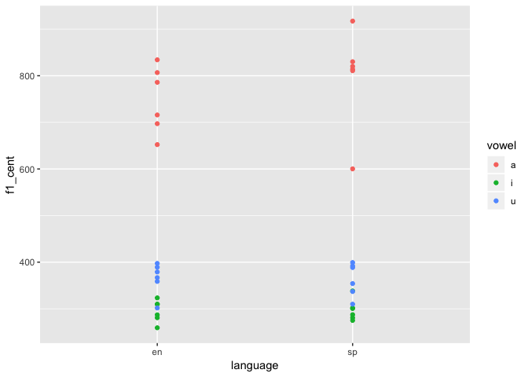
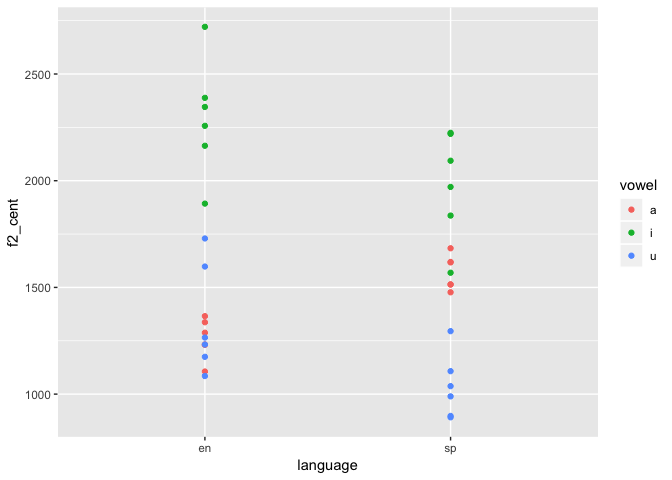
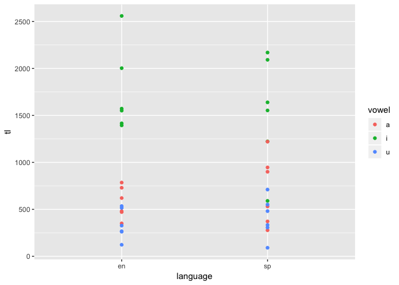
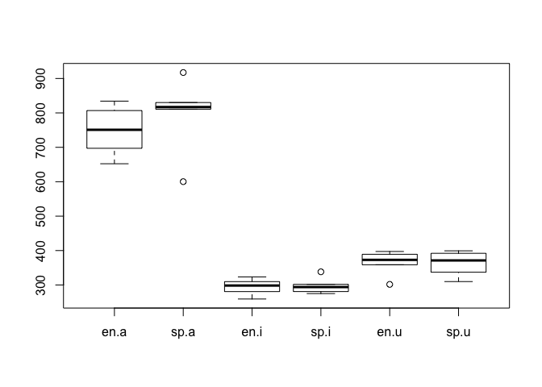
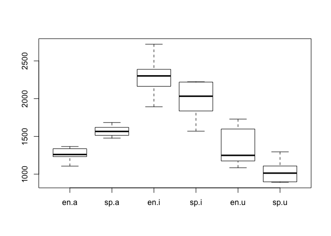
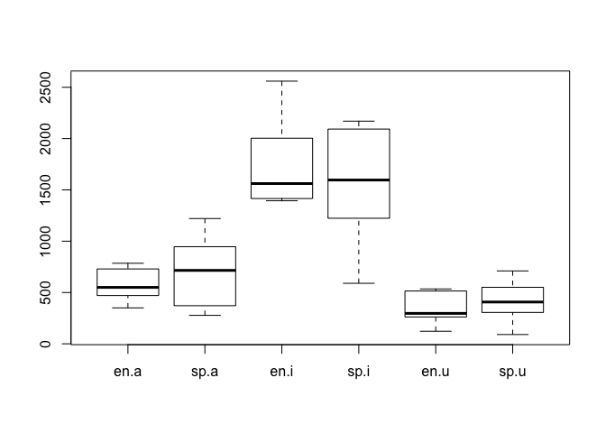

Pa\_3
================

Programming Assignment 3
========================

Respond to the following questions: Examine the portion of the script you see below. In your own words what does this section do and why does it work? Demonstrate that you understand the code….

vonset = Get starting point: 2, 2 voffset = Get end point: 2, 2 durationV = voffset - vonset per20 = vonset + (durationV \* 0.20) per35 = vonset + (durationV \* 0.35) per50 = vonset + (durationV \* 0.50) per65 = vonset + (durationV \* 0.65) per80 = vonset + (durationV \* 0.80)

**The code is describing the points when the vonset begins and when the voffset end and to find out the beginning and end duration you would subtract the vonset from the voffset and get the duration time.Then we find the trajectory length by sections (20, 35, 50, 65, 80) with the equations shown.**

In a few short sentences describe the general outline of the script, what the purpose is, and how it acheives this purpose (hint: focus on the section dividers and the comments)

**The script that we used this week helped us to understand how to use our data to extract the f1 and f2 centroids as well as the trajectory length, without having to do it one by one. The loop code allowed us to get all of the information we needed, such as words, f1\_cent, f2\_cent, language, and trajectory length in a matter of seconds, instead of having to do it all manually.**

In a few short sentences describe how the segmenting procedure you used this week differs from that used in pa\_2. What are the advantages and disadvantages?

**This segmenting procedure was different because in the previous assignment we only needed to segment words in spanish, but this time we had to use languages (english and spanish and find the mea,sd, and trajectory lengths of each by language). The advantage that this holds is that when working with a lot of data through different codes it will eventually make your life easier. The disadvantage is that if you're not too good at coding it will be a bit of stressful until you get the hang of it.**

Load libraries and data
=======================

``` r
library(tidyverse)
```

``` r
data <- read_csv("data/vowel_data.csv")
```

    ## Parsed with column specification:
    ## cols(
    ##   id = col_logical(),
    ##   item = col_character(),
    ##   vowel = col_character(),
    ##   language = col_character(),
    ##   f1_cent = col_double(),
    ##   f2_cent = col_double(),
    ##   tl = col_double(),
    ##   f1_20 = col_double(),
    ##   f1_35 = col_double(),
    ##   f1_50 = col_double(),
    ##   f1_65 = col_double(),
    ##   f1_80 = col_double(),
    ##   f2_20 = col_double(),
    ##   f2_35 = col_double(),
    ##   f2_50 = col_double(),
    ##   f2_65 = col_double(),
    ##   f2_80 = col_double()
    ## )

``` r
print(data)
```

    ## # A tibble: 36 x 17
    ##    id    item  vowel language f1_cent f2_cent    tl f1_20 f1_35 f1_50 f1_65
    ##    <lgl> <chr> <chr> <chr>      <dbl>   <dbl> <dbl> <dbl> <dbl> <dbl> <dbl>
    ##  1 NA    meet  i     en          323.   2721. 1394.  386.  362.  353.  262.
    ##  2 NA    beat  i     en          259.   2164. 1416.  279.  265.  251.  264.
    ##  3 NA    feet  i     en          310.   2257. 1572.  350   333.  312.  294.
    ##  4 NA    seat  i     en          281.   1893. 2003.  320.  300.  277.  249.
    ##  5 NA    heat  i     en          287.   2346. 2560.  272.  325.  304.  270.
    ##  6 NA    fleet i     en          310.   2388. 1551.  354.  314   276.  307.
    ##  7 NA    moss  a     en          652.   1232.  730.  734.  836.  666.  705.
    ##  8 NA    bot   a     en          834.   1232.  470.  791.  754.  882.  876.
    ##  9 NA    foug… a     en          786.   1288.  620.  795.  726.  734.  885.
    ## 10 NA    soug… a     en          697.   1337.  480.  632.  694.  746.  707.
    ## # … with 26 more rows, and 6 more variables: f1_80 <dbl>, f2_20 <dbl>,
    ## #   f2_35 <dbl>, f2_50 <dbl>, f2_65 <dbl>, f2_80 <dbl>

Descriptive statistics
----------------------

``` r
# Calculate means and standard deviations of your English/Spanish vowels ------

mean(data$f1_cent, na.rm = TRUE)  
```

    ## [1] 478.1214

``` r
sd(data$f1_cent, na.rm = TRUE)
```

    ## [1] 220.8051

``` r
mean(data$f2_cent,na.rm = TRUE)
```

    ## [1] 1582.48

``` r
sd(data$f2_cent,na.rm = TRUE)
```

    ## [1] 477.347

``` r
mean(data$tl,na.rm = TRUE)
```

    ## [1] 887.3008

``` r
sd (data$tl,na.rm = TRUE)
```

    ## [1] 653.3494

``` r
# -----------------------------------------------------------------------------
```

``` r
# 1. Plot trajectory length as a function of vowel and language ---------------

ggplot(data, aes(x = language, y = f1_cent)) +
  geom_point(aes(color = vowel))
```



``` r
ggplot(data, aes(x = language, y = f2_cent)) +
  geom_point(aes(color = vowel))
```



``` r
ggplot(data, aes(x = language, y = tl)) +
  geom_point(aes(color = vowel))
```



``` r
aggregate(f1_cent ~ language + vowel , FUN = sd, data = data)
```

    ##   language vowel   f1_cent
    ## 1       en     a  70.85745
    ## 2       sp     a 105.14478
    ## 3       en     i  23.59802
    ## 4       sp     i  22.68043
    ## 5       en     u  34.26383
    ## 6       sp     u  35.71660

``` r
boxplot(f1_cent ~ language + vowel, data = data)
```



``` r
aggregate(f2_cent ~ language + vowel, FUN = sd, data = data)
```

    ##   language vowel   f2_cent
    ## 1       en     a  92.81866
    ## 2       sp     a  80.57717
    ## 3       en     i 273.24607
    ## 4       sp     i 252.77896
    ## 5       en     u 255.88251
    ## 6       sp     u 151.26708

``` r
boxplot(f2_cent ~ language + vowel, data = data)
```



``` r
aggregate(tl ~ language + vowel, FUN = sd, data = data)
```

    ##   language vowel       tl
    ## 1       en     a 167.6254
    ## 2       sp     a 370.5760
    ## 3       en     i 453.7170
    ## 4       sp     i 585.6460
    ## 5       en     u 159.6719
    ## 6       sp     u 216.2422

``` r
boxplot(tl ~ language + vowel, data = data)
```



``` r
# -----------------------------------------------------------------------------
```
